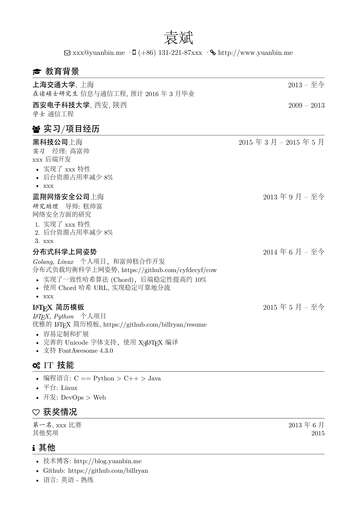

# Résumé

Hit branch [master](https://github.com/billryan/resume/tree/master) if you wanna an English résumé.

一个优雅的 \LaTeX\ 简历模板, 使用 \XeLaTeX\ 编译, 因为受不了古老的`res`和不太适合作为一页纸简历的`moderncv`, 遂自己动手写了这个模板， 受以下项目启发：

- [zachscrivena/simple-resume-cv](https://github.com/zachscrivena/simple-resume-cv)
- [res](https://www.ctan.org/pkg/res)
- [JianXu's CV](http://www.jianxu.net/en/files/JianXu_CV.pdf)
- [paciorek's CV/Resume template](http://www.stat.berkeley.edu/~paciorek/computingTips/Latex_template_creating_CV_.html)
- [How to write a LaTeX class file and design your own CV (Part 1) - ShareLaTeX](https://www.sharelatex.com/blog/2011/03/27/how-to-write-a-latex-class-file-and-design-your-own-cv.html)

其中最后一条 shareLaTeX 的总结清晰易懂，强烈建议围观。

## Features

- 极其容易定制和扩展 (`res`模板中枪倒地...)
- 完善的 Unicode 字体支持, 因为用的是 \XeLaTeX\ 嘛
- 完美的中文支持，使用 Adobefonts
- 支持 FontAwesome 4.3.0 (目前还不支持使用别名)

### Sample Output



## Usage

1. ShareLaTeX 在线编译，麻麻再也不用担心系统和发行版的问题了
2. 使用较新的 \LaTeX\ 发行版在本地计算机编译

如果确定只需要中文简历的话单独克隆 `zh_CN` 分支即可, 需要注意的是该分支包含 Adobe 的宋楷黑仿四套中文字体，体积较大，如果本地安装有Adobe这四套字体的使用 master 英文模板即可。

```
git clone https://github.com/billryan/resume.git --branch zh_CN --depth 1 --single-branch <folder>
```

如果系统已确定安装有 Adobe 的四套中文字型，在文档的开始处使用包`zh_CN-Adobefonts_internal`, 如果没有安装则使用包`zh_CN-Adobefonts_external`, 在 ShareLaTeX 上编译需要使用包`zh_CN-Adobefonts_external`.

其他具体使用可参考给出的范例，都是极其简单易懂的宏，建议先看看 [How to write a LaTeX class file and design your own CV (Part 1) - ShareLaTeX](https://www.sharelatex.com/blog/2011/03/27/how-to-write-a-latex-class-file-and-design-your-own-cv.html) 和 [How to write a LaTeX class file and design your own CV (Part 2) - ShareLaTeX](https://www.sharelatex.com/blog/2013/06/28/how-to-write-a-latex-class-file-and-design-your-own-cv.html) 了解下该模板的简单背景，下面就一些新定义的宏做简要介绍。

### 宏

- `\name`: 姓名
- `\contactInfo`: 联系信息, 需要三项信息，分别是{邮箱}{手机号}{个人主页}
- `\basicContactInfo`: 简要的联系信息, 需要 项信息, 分别是{邮箱}{手机号}, 没有个人主页的用这个
- `\section`: 用于分节, 如教育背景, 实习/项目经历等
- `\subsection`: 用于小节标题, 无日期选项
- `\datedsubsection`: 用于小节标题, 简历中使用最广，第二项为时间区间，自动右对齐
- `\itemize`: 清单列表，简历中应用最广
- `\enumerate`: 枚举列表，数字标号

### FontAwesome

首先在 [Font Awesome Icons](http://fortawesome.github.io/Font-Awesome/icons/) 上选中自己想使用的图标(暂不支持 alias)，然后在 [fontawesome.sty](https://github.com/billryan/resume/blob/zh_CN/fontawesome.sty) 中找到相应的宏, 将其作为普通文本一样使用。

其他的可以自行参考相应 cls 和 tex 文件。

## License

[The MIT License (MIT)](http://opensource.org/licenses/MIT)

Copyrighted fonts are not subjected to this License.
