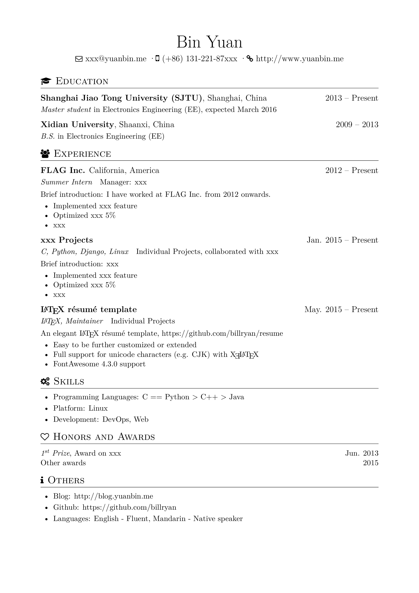

# Résumé

An elegant \LaTeX\ résumé template, compiled with \XeLaTeX. Inspired by 

- [zachscrivena/simple-resume-cv](https://github.com/zachscrivena/simple-resume-cv)
- [res](https://www.ctan.org/pkg/res)
- [JianXu's CV](http://www.jianxu.net/en/files/JianXu_CV.pdf)
- [paciorek's CV/Resume template](http://www.stat.berkeley.edu/~paciorek/computingTips/Latex_template_creating_CV_.html)
- [How to write a LaTeX class file and design your own CV (Part 1) - ShareLaTeX](https://www.sharelatex.com/blog/2011/03/27/how-to-write-a-latex-class-file-and-design-your-own-cv.html)

## Features

- Easy to be further customized or extended
- Full support for unicode characters (e.g. CJK) with \XeLaTeX\
- Perfect Simplified Chinese fonts support with Adobefonts
- FontAwesome 4.3.0 support (not support alias yet)

## Usage

1. ShareLaTeX online editor
2. Compile tex on your Computer

If you only need résumé in English or have installed Adobe Simplified Chinese in your OS, you'd better clone only master branch, since the Chinese fonts files are too large.

```
git clone https://github.com/billryan/resume.git --branch master --depth 1 --single-branch <folder>
```

### Sample Output



## License

[The MIT License (MIT)](http://opensource.org/licenses/MIT)

Copyrighted fonts are not subjected to this License.
